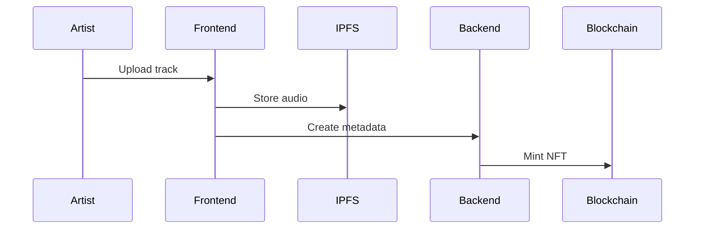
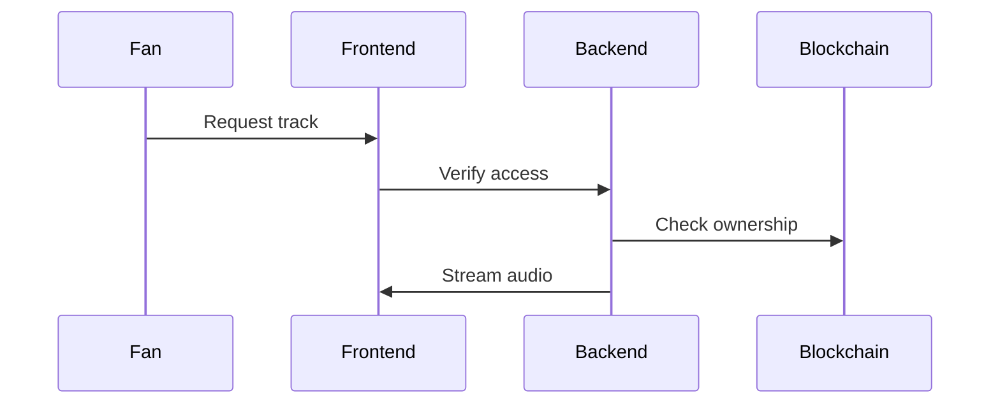

# System Architecture

## Overview

The platform consists of four main components:
1. Smart Contracts (Solidity)
2. Backend API (NestJS)
3. Frontend (Next.js)
4. Infrastructure Services

## Smart Contracts

### Core Contracts
- MusicNFT: Individual track NFTs
- AlbumNFT: Collection of tracks
- BadgeNFT: Achievement system
- MerchandiseNFT: Physical/digital goods
- EventTicketNFT: Event access

### Libraries
- RoyaltyEngine: Royalty calculations
- SafeBatchTransfer: Batch operations
- StringUtils: String manipulation

## Backend Services

### Core Services
- AuthService: Authentication & authorization
- UserService: User management
- SearchService: Elasticsearch integration
- NotificationService: Real-time updates
- AuditService: System logging

### Supporting Services
- CacheService: Redis caching
- EmailService: Email notifications
- WebSocketService: Real-time communication
- RateLimiterService: Rate limiting

## Frontend Architecture

### Core Features
- Web3 Integration
- Real-time Updates
- Audio Streaming
- File Management
- Search & Discovery

### State Management
- Zustand for global state
- React Query for API cache
- Web3 hooks for blockchain

## Data Flow

1. Music Upload

2. Music Streaming

## Security Architecture

1. Authentication
- Web3 wallet connection
- JWT tokens
- Role-based access

2. Data Protection
- End-to-end encryption
- IPFS content addressing
- Rate limiting

3. Smart Contract Security
- Access control
- Reentrancy guards
- Emergency pause

## Scalability

1. Backend
- Horizontal scaling
- Load balancing
- Database sharding
- Cache optimization

2. Frontend
- CDN integration
- Code splitting
- Asset optimization
- PWA support

3. Blockchain
- Batch transactions
- Gas optimization
- Event indexing
